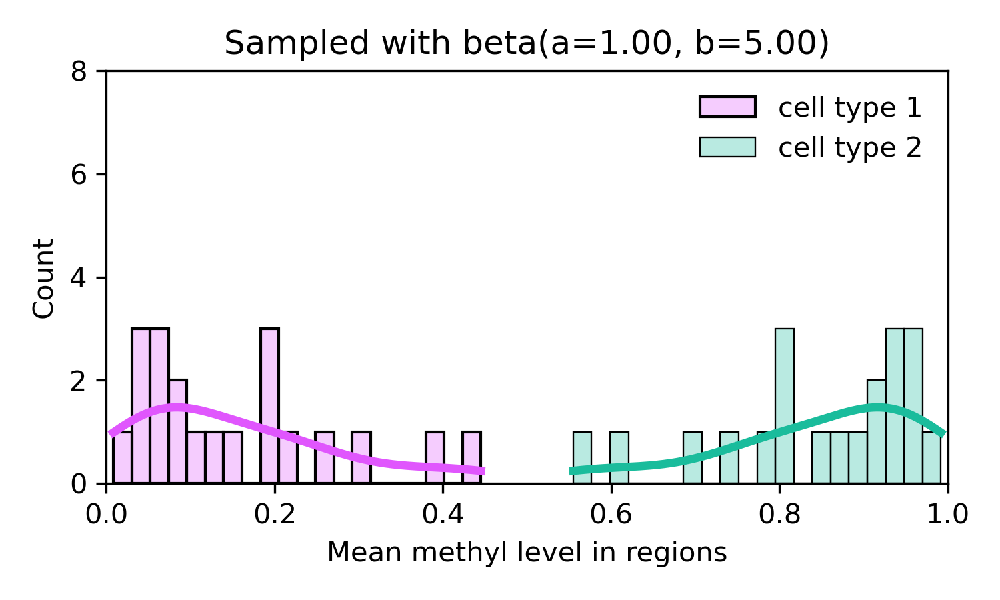
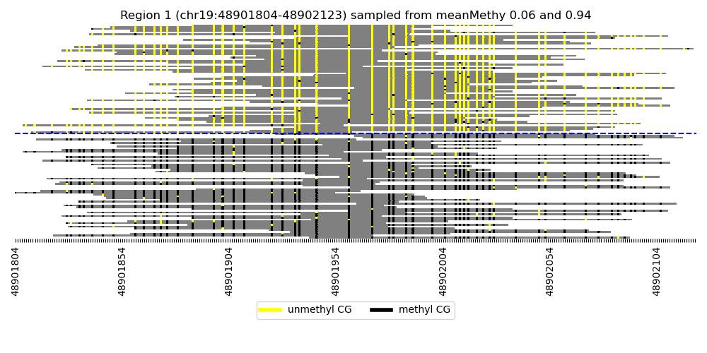

# Tumour-normal read-level methylation pattern and pseudo-bulk simulator

Read-level methylome simulator using a beta-binomial distribution. 

It currently supports only two cell-type simulations (tumour and normal).

Pseudo-bulk samples with random cell-type compositions can be also simulated with the read-level methylomes. 


## Quick start
````
python main.py --help
usage: main.py [-h] -r F_REF [-d F_REGION] [-o OUTPUT_DIR] [--save_img]
               [-ng N_REGIONS] [-a A] [-b B] [-nr N_READS] [-k K_MER]
               [-l LEN_READ] [--seed SEED] [--bulk] [-nb N_BULKS] [-s STD]

optional arguments:
  -h, --help            show this help message and exit
  -r F_REF, --f_ref F_REF
                        .fasta file for the reference genome
  -d F_REGION, --f_region F_REGION
                        tab-separated .csv file, DMRs should be given with
                        mean methylation level of each cell type, chr, start
                        and end. n_regions will be selected from hg19 CpG
                        islands if the file is not given
  -o OUTPUT_DIR, --output_dir OUTPUT_DIR
                        a directory where all generated results will be saved
                        (default: ./)
  --save_img            Save simulated methylation patterns as a .png file
                        (default: False)
  -ng N_REGIONS, --n_regions N_REGIONS
                        Number of regions to select from CGIs when the region
                        file is not given (default: 100)
  -a A, --a A           alpha parameter of the beta-binomial distribution to
                        simulate read-level methylomes (default: 1e-6)
  -b B, --b B           beta parameter of the beta-binomial distribution to
                        simulate read-level methylomes (default: 5)
  -nr N_READS, --n_reads N_READS
                        Read coverage to simulate in each DMR (default: 120)
  -k K_MER, --k_mer K_MER
                        K to process the simulated read sequences into K-mer
                        sequence (default: 1)
  -l LEN_READ, --len_read LEN_READ
                        Read length to simulate (default: 150)
  --seed SEED           seed number (default: 950410)
  --bulk                Whether you want to generate pseudo-bulks or the
                        entire dataset (default: False)
  -nb N_BULKS, --n_bulks N_BULKS
                        Number of bulks, Applicable only when --bulk is True
                        (default: 1)
  -s STD, --std STD     Standard deviation to sample local proportions. The
                        larger value is given, the more varying local
                        proportions are sampled from a Gaussian distribution
                        centred at the global proportion (default: 0.0)

````
## Output example 
#### Sampled region-wise methylation level


#### Simulated read-level methylomes

